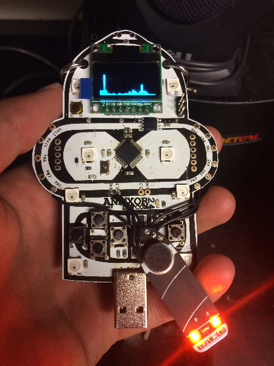

### Cigar Mic
Designed for DEF CON 24 to compliment the [Bender Badge by AND!XOR](https://github.com/ANDnXOR/ANDnXOR_DC24_Badge). The Cigar Mic adds an audio input to the Bender Badge in order to show a real-time spectrum anaysis of any activity occuring between 0 and 10kHz around the badge.


#### Configuration
Cigar mic requires 3.3V, GND, an ADC input pin, and three 3.3V output pins. The included software is compatible with AND!XOR’s Bender Badge and should be connected as follows:
```
OUT  -> PA1
GND  -> GND
3.3V -> 3.3V
L1   -> PA3
L2   -> PA4
L3   -> PA5
```


